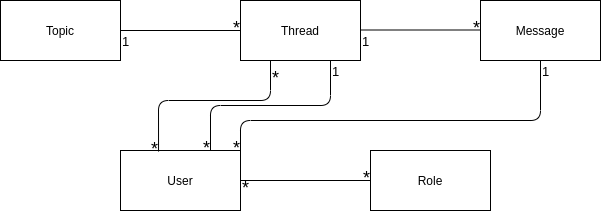

### Database schema

Thread and Message -tables have a creator_id (one-to-many relationship with User-table). Thread-table also has
a many-to-many relationship with User-table. This relationship is used if created thread is marked as secret to indicate
secret users associated with the thread. All the tables can be found from 
`application/models.py` and `application/topics/models.py`.

